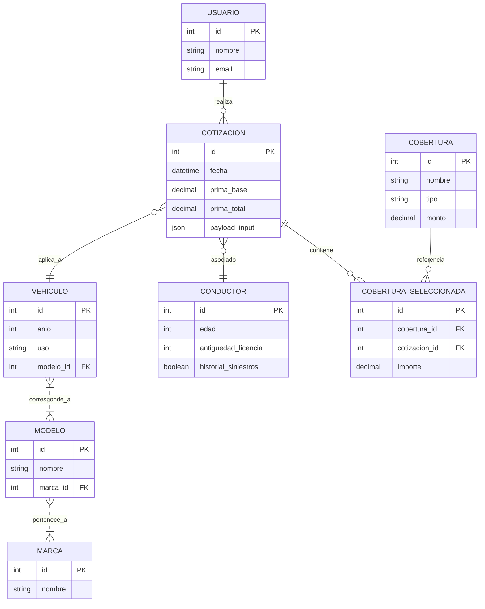
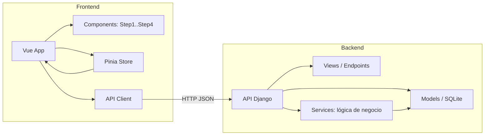

# Cotizador Automotor
El MVP puede avanzar a un CRM de compañias o broker de seguros o cotizacion por asistentes virtuales
**Resumen del proyecto**
- **Propósito:** Sistema web para cotizar seguros de autos, con frontend en SPA (Vite + Vue) y backend en Django. Permite al usuario ingresar datos del vehículo y conductor, seleccionar coberturas y obtener una cotización calculada.
- **Alcance funcional:** captura de datos del vehículo y conductor, selección de coberturas, cálculo de prima, visualización de resultado y persistencia básica en base de datos para análisis y pruebas.

**Actores**
- **Usuario final:** Persona que solicita la cotización.
- **Administrador / QA:** Revisa datos, pruebas y semilla de datos.
- **Sistema externo (futuro):** pasarela de pagos o servicios de valoración de vehículos.

**Visión general del flujo**
1. Usuario accede a la interfaz del cotizador.
2. Completa pasos: Datos del vehículo → Datos del conductor → Selección de coberturas.
3. El frontend envía la solicitud al backend para calcular la prima.
4. Backend aplica reglas y devuelve la cotización con desglose.
5. Usuario visualiza el resultado y puede reiniciar o ajustar parámetros.

**Requisitos funcionales principales**
- RF1: Capturar datos del vehículo (marca, modelo, año, uso).
- RF2: Capturar datos del conductor (edad, antigüedad de licencia, historial).
- RF3: Permitir seleccionar varias coberturas y límites.
- RF4: Calcular prima según reglas definidas en `cotizador/services.py`.
- RF5: Exponer API REST para obtener opciones y realizar cotizaciones.
- RF6: Semilla de datos para pruebas automatizadas (`management/commands/seed_data.py`).

**Reglas de negocio (resumen)**
- Edad del conductor y antigüedad de la licencia impactan en recargos.
- Año del vehículo afecta al factor de depreciación.
- Coberturas adicionales suman porcentajes o importes fijos.
(Ver `cotizador/services.py` para la lógica completa.)

**Estructura del repositorio**
- `cotizador-automotor-back/`: Backend Django
  - `manage.py`, `db.sqlite3`, `config/` (settings, urls), `cotizador/` (modelos, servicios, vistas, serializers)
  - `cotizador/management/commands/seed_data.py`: script para poblar datos de prueba
- `cotizador-automotor-front/`: Frontend (Vite + Vue + TypeScript)
  - `src/`: componentes, vistas, stores y API client
  - Componentes clave: `Step1Vehiculo.vue`, `Step2Conductor.vue`, `Step3Cobertura.vue`, `Step4Resultado.vue`

**APIs relevantes**
- `GET /api/opciones/` — Obtener listas desplegables y opciones (marcas, modelos, coberturas).
- `POST /api/cotizar/` — Enviar datos y recibir cotización (payload: vehículo, conductor, coberturas).
- `GET /api/resultados/:id` — (opcional) Obtener cotización guardada.
(Consultar `cotizador/urls.py` y `cotizador/views.py` para rutas exactas.)

**Instalación y ejecución (resumen para desarrollo)**
- Backend (python 3.9+ recomendado):

  1. Crear y activar entorno virtual:

     ```powershell
     python -m venv .venv
     .\.venv\Scripts\Activate
     ```

  2. Instalar dependencias:

     ```powershell
     pip install -r cotizador-automotor-back\requirements.txt
     ```

  3. Migrar y sembrar datos de prueba:

     ```powershell
     cd cotizador-automotor-back
     python manage.py migrate
     python manage.py loaddata initial_data || python manage.py seed_data
     python manage.py runserver
     ```

- Frontend (Node 16+ recomendado):

  1. Instalar dependencias:

     ```bash
     cd cotizador-automotor-front
     npm install
     ```

  2. Ejecutar en desarrollo:

     ```bash
     npm run dev
     ```

**Cómo probar funcionalmente**
- Flujo principal: probar los 4 pasos en la UI y verificar la coherencia del desglose de la prima.
- Casos de borde: conductor joven, vehículo antiguo, combinación de coberturas máximas.
- Verificar logs y respuestas de la API en `cotizador-automotor-back`.

**Archivos clave para revisión funcional**
- Lógica de negocio: `cotizador-automotor-back\cotizador\services.py`
- Serialización y validaciones: `cotizador-automotor-back\cotizador\serializers.py`
- Endpoints: `cotizador-automotor-back\cotizador\views.py` y `cotizador-automotor-back\cotizador\urls.py`
- Interfaz: `cotizador-automotor-front\src\views\CotizadorView.vue` y pasos en `components/`.

**Pendientes y mejoras sugeridas**
- Documentar detalladamente las fórmulas y coeficientes usados en el cálculo.
- Añadir validaciones y mensajes de negocio más descriptivos para el usuario.
- Integrar pruebas automáticas (unitarias y de integración) para la lógica de cotización.
- Preparar endpoints para persistencia y consulta histórica de cotizaciones.

Si quieres, adapto este README para integrarlo dentro de `cotizador-automotor-back/README.md` o lo traduzco a un formato más técnico (con ejemplos de payloads y respuestas).

**Diagramas funcionales y técnicos**

A continuación se incluyen diagramas en formato Mermaid para referencia rápida (puedes visualizarlos en GitHub o en un renderizador compatible con Mermaid).

**Diagrama Entidad-Relación (ER)**



**Diagrama de Procesos (BPM / flujo principal)**

```mermaid
flowchart TD
   A[Inicio: Usuario abre cotizador] --> B[Step1: Datos del vehículo]
   B --> C[Step2: Datos del conductor]
   C --> D[Step3: Selección de coberturas]
   D --> E[Enviar datos al backend]
   E --> F{Validación}
   F -- Error --> G[Mostrar errores y correcciones]
   F -- OK --> H[Calcular prima en `services.py`]
   H --> I[Devolver cotización con desglose]
   I --> J[Mostrar resultado en UI]
   J --> K[Fin / Guardar cotización (opcional)]
```

**Diagrama de Componentes (arquitectura de alto nivel)**

